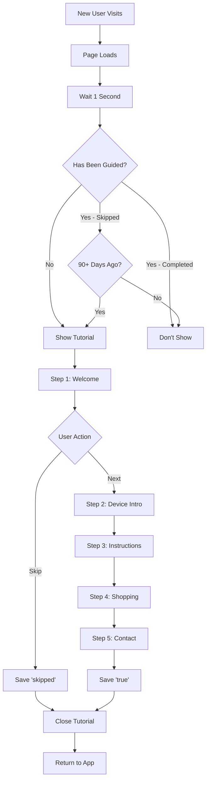

# ✅ PWA Installation Tutorial - Implementation Complete

## 🎉 Summary

Your Gadget World app now has a **comprehensive, device-aware PWA installation tutorial** that:

1. ✅ **Automatically detects** user's device (iOS, Android, or Desktop)
2. ✅ **Provides step-by-step instructions** specific to each platform
3. ✅ **Saves progress** in localStorage with `guided: true` flag
4. ✅ **Beautiful UI** with typewriter animations and color-coded gradients
5. ✅ **User-friendly** with skip options and progress tracking

---

## 📁 Files Modified

### Components
1. **[components/WelcomeTutorial.tsx](components/WelcomeTutorial.tsx)**
   - Main tutorial component with 5-step flow
   - Device detection logic
   - Device-specific installation instructions (iOS/Android/Desktop)
   - localStorage tracking (`guided: 'true'` on completion, `'skipped'` on skip)
   - Typewriter animation effect
   - Clickable contact links

2. **[components/WelcomeTutorialWrapper.tsx](components/WelcomeTutorialWrapper.tsx)**
   - Wrapper that checks localStorage status
   - Shows tutorial only to new users
   - 1-second delay for better UX
   - Optional re-display after 90 days for skipped users

### Documentation
3. **[PWA_INSTALLATION_TUTORIAL.md](PWA_INSTALLATION_TUTORIAL.md)**
   - Comprehensive guide explaining the system
   - localStorage schema documentation
   - Customization options
   - Troubleshooting guide

4. **[PWA_TUTORIAL_TESTING.md](PWA_TUTORIAL_TESTING.md)**
   - Quick testing commands
   - Browser console snippets
   - Device simulation guide
   - Testing checklist

5. **[PWA_TUTORIAL_WALKTHROUGH.md](PWA_TUTORIAL_WALKTHROUGH.md)**
   - Visual representation of each step
   - ASCII art mockups
   - User journey map
   - Feature highlights

---

## 🚀 How It Works

### First-Time User Experience

```
1. User visits Gadget World
2. Page loads normally (1 second delay)
3. Tutorial modal appears automatically
4. User sees 5 guided steps:
   
   Step 1: Welcome message
   Step 2: Device-specific introduction
   Step 3: Detailed installation instructions with numbered steps
   Step 4: Shopping guide
   Step 5: Contact information (with clickable links)
   
5. On completion: localStorage saves:
   - gadgetworld-tutorial-guided: 'true'
   - gadgetworld-tutorial-completed-date: ISO timestamp
   
6. Tutorial won't show again
```

### If User Skips

```
- Tutorial saves: guided: 'skipped'
- Won't show again for 90 days
- User can still use app normally
```

---

## 📱 Device-Specific Instructions

### iOS (iPhone/iPad) - Blue Gradient
```
Step 1: Open Safari
Step 2: Tap the Share button (📤)
Step 3: Scroll and find "Add to Home Screen"
Step 4: Tap "Add" - Done! 🎉
```

### Android - Green Gradient
```
Step 1: Look for the Install prompt
Step 2: Or tap the Menu (⋮)
Step 3: Select "Add to Home Screen" or "Install App"
Step 4: Tap "Install" - Done! 🎉
```

### Desktop - Purple Gradient
```
Step 1: Look for the Install icon in address bar
Step 2: Click "Install"
Step 3: Confirm installation - Done! 🎉
```

---

## 💾 localStorage Implementation

### Keys Used
```javascript
// Tutorial completion status
localStorage.getItem('gadgetworld-tutorial-guided')
// Values: 'true' | 'skipped' | null

// Completion timestamp
localStorage.getItem('gadgetworld-tutorial-completed-date')
// Value: ISO 8601 timestamp string
```

### Example States

**New User** (tutorial will show):
```javascript
// Both keys are null/undefined
```

**Completed Tutorial** (won't show again):
```javascript
{
  'gadgetworld-tutorial-guided': 'true',
  'gadgetworld-tutorial-completed-date': '2026-02-04T10:30:45.123Z'
}
```

**Skipped Tutorial** (may show after 90 days):
```javascript
{
  'gadgetworld-tutorial-guided': 'skipped',
  'gadgetworld-tutorial-completed-date': '2026-02-04T10:30:45.123Z'
}
```

---

## 🧪 Quick Testing

### Show Tutorial Now
```javascript
// In browser console
localStorage.removeItem('gadgetworld-tutorial-guided');
localStorage.removeItem('gadgetworld-tutorial-completed-date');
location.reload();
```

### Check Current Status
```javascript
console.log({
  guided: localStorage.getItem('gadgetworld-tutorial-guided'),
  date: localStorage.getItem('gadgetworld-tutorial-completed-date')
});
```

### Hide Tutorial Forever
```javascript
localStorage.setItem('gadgetworld-tutorial-guided', 'true');
localStorage.setItem('gadgetworld-tutorial-completed-date', new Date().toISOString());
location.reload();
```

---

## ✨ Key Features

### User Experience
- ✅ **Typewriter animation** - Engaging text reveal effect
- ✅ **Progress bar** - Shows current step (1-5)
- ✅ **Skip option** - Users can skip if desired
- ✅ **Close button** - X button in top-right corner
- ✅ **Step counter** - "Step X of 5" indicator
- ✅ **Smooth transitions** - Elegant animations

### Device Intelligence
- ✅ **Auto device detection** - Identifies iOS/Android/Desktop
- ✅ **Custom instructions** - Different steps per platform
- ✅ **Color-coded UI** - Blue (iOS), Green (Android), Purple (Desktop)
- ✅ **Platform-specific icons** - Appropriate emojis and symbols

### Data Persistence
- ✅ **localStorage tracking** - Remembers completion
- ✅ **Guided flag** - `'true'` or `'skipped'` state
- ✅ **Timestamp** - ISO date when completed
- ✅ **Smart re-display** - Optional 90-day re-show for skipped users

### Interactive Elements
- ✅ **Clickable WhatsApp** - Opens WhatsApp chat
- ✅ **Clickable Email** - Opens email client
- ✅ **Responsive design** - Works on all screen sizes
- ✅ **Touch-friendly** - Large tap targets

---

## 📊 Tutorial Flow



---

## 🎯 Goals Achieved

### Primary Requirements
- ✅ **Comprehensive PWA guidance** - Step-by-step instructions
- ✅ **Device-specific tutorials** - iOS, Android, Desktop support
- ✅ **localStorage tracking** - `guided: true` flag saved
- ✅ **New user targeting** - Only shows to first-time visitors
- ✅ **Skip functionality** - Users have control

### Additional Features
- ✅ **Visual polish** - Beautiful gradients and animations
- ✅ **Contact integration** - Clickable support links
- ✅ **Shopping onboarding** - Product catalog introduction
- ✅ **Progress tracking** - Visual step indicators
- ✅ **Accessibility** - Keyboard navigation support

---

## 📞 Contact Info Included

The tutorial displays and links to:
- **WhatsApp**: [0753466211](https://wa.me/254753466211)
- **Email**: [gadgetworldinternational41@gmail.com](mailto:gadgetworldinternational41@gmail.com)

---

## 🔧 Customization

Want to modify the tutorial? Check these files:

### Change Step Content
Edit [components/WelcomeTutorial.tsx](components/WelcomeTutorial.tsx) - `steps` array (around line 33)

### Change Re-display Duration
Edit [components/WelcomeTutorialWrapper.tsx](components/WelcomeTutorialWrapper.tsx) - line 28
```typescript
const ninetyDays = 90 * 24 * 60 * 60 * 1000; // Change 90 to desired days
```

### Change Initial Delay
Edit [components/WelcomeTutorialWrapper.tsx](components/WelcomeTutorialWrapper.tsx) - line 17
```typescript
setTimeout(() => setShowTutorial(true), 1000); // Change 1000ms
```

### Change Typing Speed
Edit [components/WelcomeTutorial.tsx](components/WelcomeTutorial.tsx) - typeText function
```typescript
const typeText = (text: string, speed: number = 30) => {
  // Lower speed = faster typing
```

---

## 📱 Browser Support

| Browser | Platform | Support |
|---------|----------|---------|
| Safari | iOS 11.3+ | ✅ Full |
| Chrome | Android | ✅ Full |
| Chrome | Desktop | ✅ Full |
| Edge | Desktop | ✅ Full |
| Firefox | All | ⚠️ Limited PWA |
| Samsung Internet | Android | ✅ Full |

---

## 🎨 Design Details

### Color Scheme
- **iOS**: Blue gradient (`from-blue-50 to-indigo-50`)
- **Android**: Green gradient (`from-green-50 to-emerald-50`)
- **Desktop**: Purple gradient (`from-purple-50 to-pink-50`)
- **Progress bar**: Gray-900 (dark)
- **Background**: White modal with black/50 overlay

### Typography
- **Titles**: 'text-lg font-semibold' (18px, 600 weight)
- **Content**: 'text-sm' (14px)
- **Small text**: 'text-xs' (12px)

### Spacing
- **Modal**: 'max-w-md' (448px max width)
- **Padding**: 'p-6' (24px)
- **Gaps**: 'space-y-6' (24px vertical)

---

## ✅ Next Steps

Your tutorial is **ready to use**! Here's what happens next:

1. **Deploy your app** - Push changes to production
2. **Test on real devices** - Try on iPhone, Android, Desktop
3. **Monitor analytics** - Track tutorial completion rates (if you add analytics)
4. **Gather feedback** - See what users think
5. **Iterate** - Improve based on user data

---

## 📚 Documentation Files

For detailed information, refer to:

1. **[PWA_INSTALLATION_TUTORIAL.md](PWA_INSTALLATION_TUTORIAL.md)**
   - Complete system documentation
   - Technical implementation details
   - Customization guide

2. **[PWA_TUTORIAL_TESTING.md](PWA_TUTORIAL_TESTING.md)**
   - Testing procedures
   - Browser console commands
   - Debugging guide

3. **[PWA_TUTORIAL_WALKTHROUGH.md](PWA_TUTORIAL_WALKTHROUGH.md)**
   - Visual walkthrough
   - Step-by-step screenshots (ASCII art)
   - User experience flow

---

## 🎉 Implementation Complete!

Your Gadget World app now provides a **professional, comprehensive PWA installation tutorial** that:

- Guides users step-by-step
- Adapts to their device automatically  
- Saves progress in localStorage (`guided: true`)
- Provides contact information
- Looks beautiful with animations
- Works on all platforms

**Users will love the onboarding experience!** 🚀

---

Need help? Check the documentation files or test using the commands in PWA_TUTORIAL_TESTING.md!
